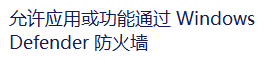
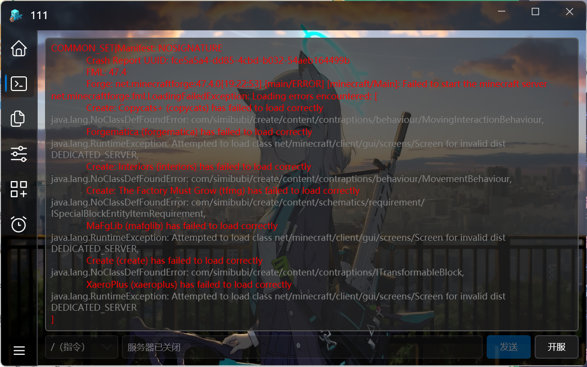

# 常见问题
## 内网穿透
如果内网穿透日志输出提示以下文字:

**无法建立连接，因为计算机主动进绝了它。**

**请检查服务器是否开启或内网映射本地端口和服务器本地端口是否匹配！**

首先查看防火墙是否关闭，可以前往：控制面板\系统和安全\Windows Defender 防火墙

如果不是我这种情况点击左边的选项这里设置的和我一样就行，如果需要防火墙功能可以点击该选项

点击浏览找到msl文件夹，双击msl程序，点击添加即可（可以点击网络类型全部选中）

如果完成以上步骤依旧提示，这时候需要看服务器设置的端口：

这里的服务器ip就是端口号，你需要去设置内网穿透需要映射的端口号或者修改服务器的端口号
**通过修改服务器端口号解决：**

在更多功能里往下翻能找到这个界面，其中有个服务器端口设置，将这里的数值修改为内网穿透需要映射的端口，也就是内网穿透创建界面的本地端口。
**通过修改内网穿透要映射的端口号解决：**
在映射界面，删除原来创建的隧道，点击添加隧道，在创建隧道界面你能在右边看到本地端口号，如下图：

**蓝色方框内**要填写的数值修改它并保证与服务器的端口保持一致，你还能看到kcp协议，默认关闭，这时候开启服务器并开启你的游戏，这时候你应该能进入游戏，如果遇到连接超时可尝试开启kcp协议或尝试切换其他节点。

**如果出现内网映射失败并且翻译为登陆失败或者超时等情况，请关闭kcp协议加速！**

## neoforge/forge安装失败导致无法开启服务器的解决办法

第一重新创建服务器，第二在安装neoforge/forge界面有下载源选项，可尝试修改下载源为官方解决（由于下载源为官方，部分情况下会出现下载较慢等情况，可以尝试修改并发数来加快下载速度，请耐心等待），第三通过安装界面点击改用命令行安装（注意：这里采用的是官方原始的办法，可能会出现下载缓慢情况），第四你可以尝试切换网络环境解决（这里不便多说，请前往百度自行搜索）。

## fabric端一直显示下载服务端

你能做的只能等待或者尝试切换网络环境。

## 如何启动猿神

请自行查询下载办法，比如百度，bing

## 服务器崩溃（持续更新）

第一种：neoforge/forge服务端崩溃后可能输出这些字样，我们可以观察到这里有灰色字样，灰色字样上面一串红色文字是你要删除的模组，你搜索这些括号内的文字并把它们删除，删除完毕你可以再次开启服务器，这时候正常情况下应该不会出现崩溃了。

还有一个非常常见的情况，控制台输出未找到主类：

看到client字样的都是客户端的端用在了服务端，这是行不通的，你可以去寻找关于该整合包的服务端，或者尝试自己手搓服务端（说白了就是资源同步），比如1.20.1fabric，你客户端和服务端都必须是这个版本，然后是模组，也就是mods文件夹，里面模组同步，还有config也要同步（不一定要），这里是因为任务系统等文件都在config文件夹里面，你可以理解为模组的配置文件，如果要跟着任务走自然也要同步config文件夹，然后就是按照上面写的崩溃类型进行排查模组。

第二种：

在这张图上我们能看到libraries的一些路径，这是neoforge/forge安装失败了，重新创建即可

第三种：这种情况少见

这里提到了ssl，这个可能是证书问题，在服务器设置往下翻找到jvm参数，输入-Djavax.net.ssl.trustStoreType=Windows-ROOT，然后点击保存并尝试开启服务器