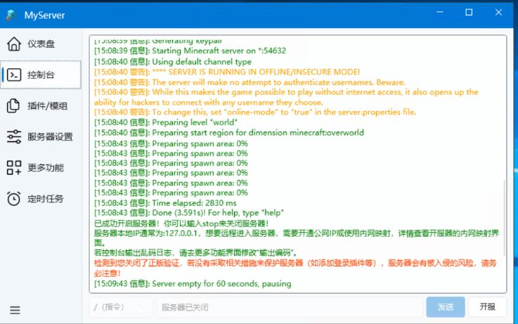
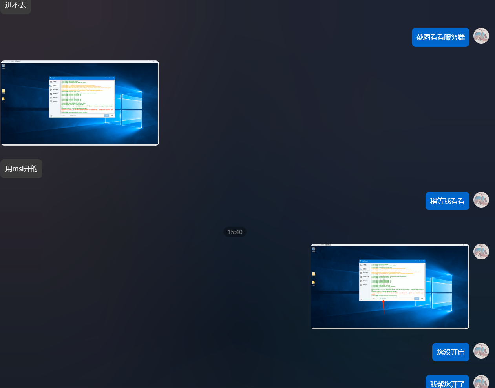
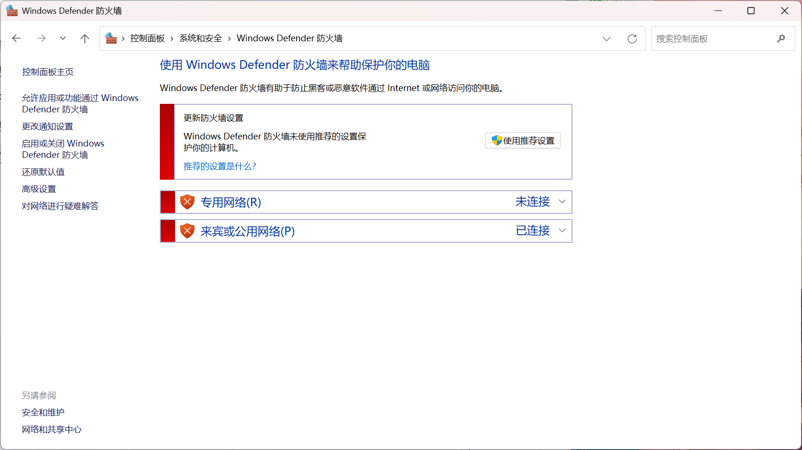
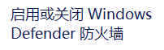
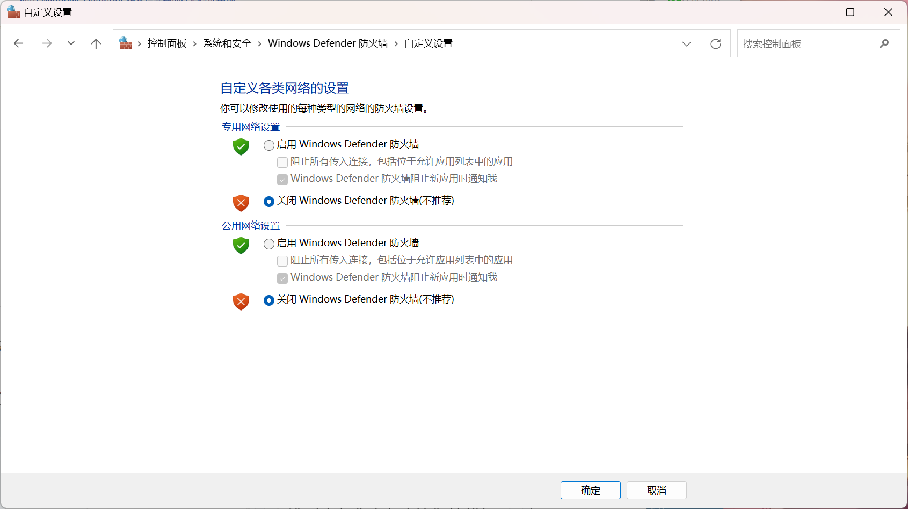
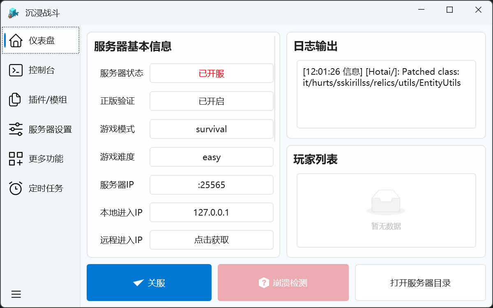
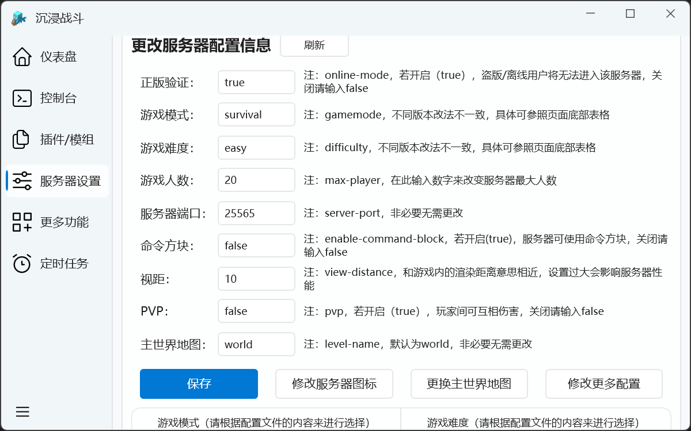
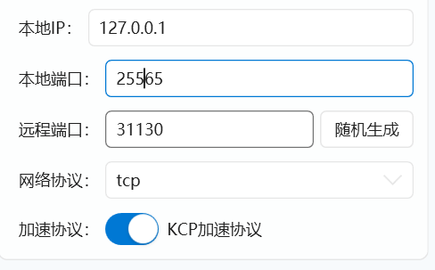

# *常见问题*

::: tip TIPS
从右边点击您需要查看的问题，我建议从头看到尾，这或许会让您在开服过程中减少查阅的时间
:::

## **服务器开了进不去**

这种情况吗？

您真的开了吗？

## **下载提示病毒，或者windows安全中心提示有病毒给程序删了**

下载提示有潜在威胁，右击点击`保留`即可，程序本身没问题，换句话就是安全中心太守护系统“安全”了，只要有一点点可疑的就删，您可以下载火绒或者其他杀毒代替他。

## **内网穿透**
如果内网穿透日志输出提示以下文字:

> **无法建立连接，因为计算机主动进绝了它。**
>
> **请检查服务器是否开启或内网映射本地端口和服务器本地端口是否匹配！**

首先查看防火墙是否关闭，可以前往：控制面板\系统和安全\Windows Defender 防火墙查看

如果不是我这种情况点击左边的

这里设置的和我一样就行

如果完成以上步骤依旧提示，这时候需要看服务器设置的`端口`：  

这里的服务器ip就是端口号，你需要去设置内网穿透需要映射的端口号或者修改服务器的端口号

**通过修改服务器端口号解决：**  

在更多功能里往下翻能找到这个界面，其中有个服务器端口设置，将这里的数值修改为内网穿透需要映射的端口，也就是内网穿透创建界面的本地端口。  

**通过修改内网穿透要映射的端口号解决：**
在映射界面，删除原来创建的隧道，点击添加隧道，在创建隧道界面你能在右边看到本地端口号，如下图：

**蓝色方框内**要填写的数值修改它并保证与服务器的端口保持一致，你还能看到kcp协议，默认关闭，这时候开启服务器并开启你的游戏，这时候你应该能进入游戏，如果遇到连接超时可尝试开启kcp协议或尝试切换其他节点。

**如果出现内网映射失败并且翻译为登陆失败或者超时等情况，请关闭kcp协议加速！**

## **neoforge/forge安装失败导致无法开启服务器的解决办法**

第一重新创建服务器，第二在安装neoforge/forge界面有下载源选项，可尝试修改下载源为官方解决（由于下载源为官方，部分情况下会出现下载较慢等情况，可以尝试修改并发数来加快下载速度，请耐心等待），第三通过安装界面点击改用命令行安装（注意：这里采用的是官方原始的办法，可能会出现下载缓慢情况），第四你可以尝试切换网络环境解决（这里不便多说，请自行搜索）。

## **fabric端一直显示下载服务端**

你能做的只能等待或者尝试切换网络环境，也可以试试重新创建。

## **如何启动猿神**

[国际服](https://genshin.hoyoverse.com/zh-tw/)|[国服](https://webstatic.mihoyo.com/ys/event/e20210203-fab/)
