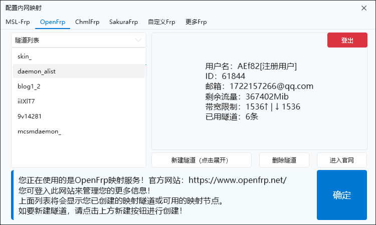
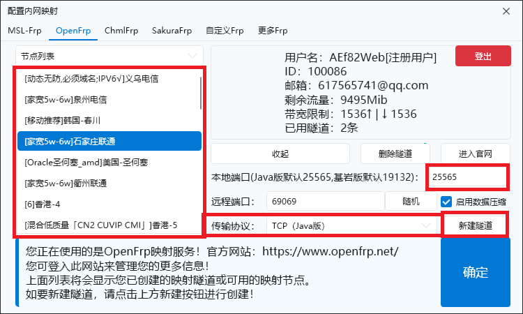
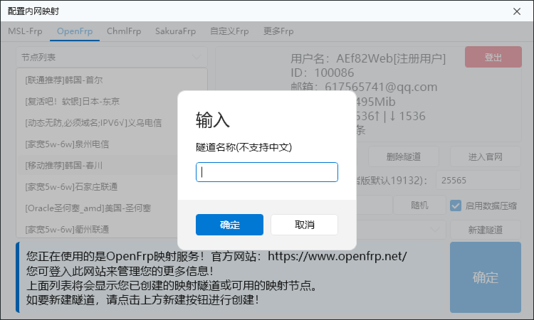
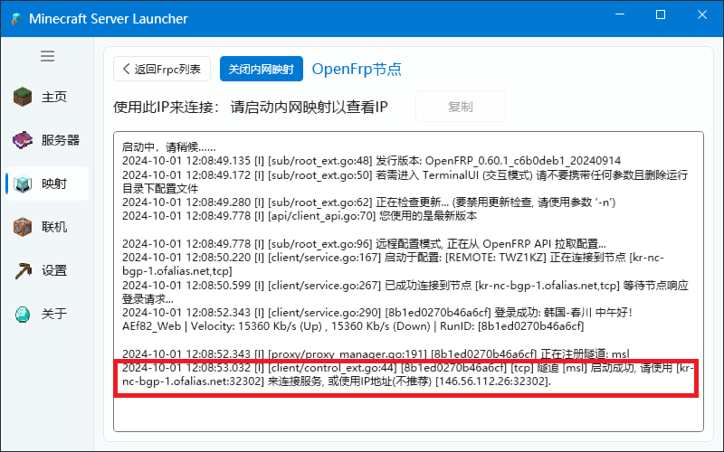

# 内网穿透配置

## MSL-Frp

点击图中的添加按钮:


打开新窗口,在上方选择```MSL-FRP```:


在左侧选择节点,在右侧填写好信息即可,点击确定会保存配置并返回主窗口.


双击进去刚刚创建的隧道,点击```启动内网映射```按钮即可启动:


## OpenFrp

OpenFRP官网链接 [点此跳转](https://www.openfrp.net/)

OpenFRP官方文档 [点此跳转](https://openfrp.wiki)


点击图中的配置按钮:


打开新窗口,在上方选择```OpenFrp```,并根据提示注册/登录:


登陆完成后的效果如图:



如需创建新隧道,点击下方的```新建隧道(点击展开)```按钮:


在左方选择欲使用的节点,一般来说越靠近玩家的节点延迟会越低;
同时在右侧配置相应的信息，红框区域是你所要修改的，更改完毕后点击```新建隧道```：



输入隧道名:



提示创建成功后,在左边选择刚创建的隧道:


回到主窗口，双击进去刚刚创建的隧道,点击```启动内网映射```按钮即可启动:




红框区域即为可供链接的地址和端口。

