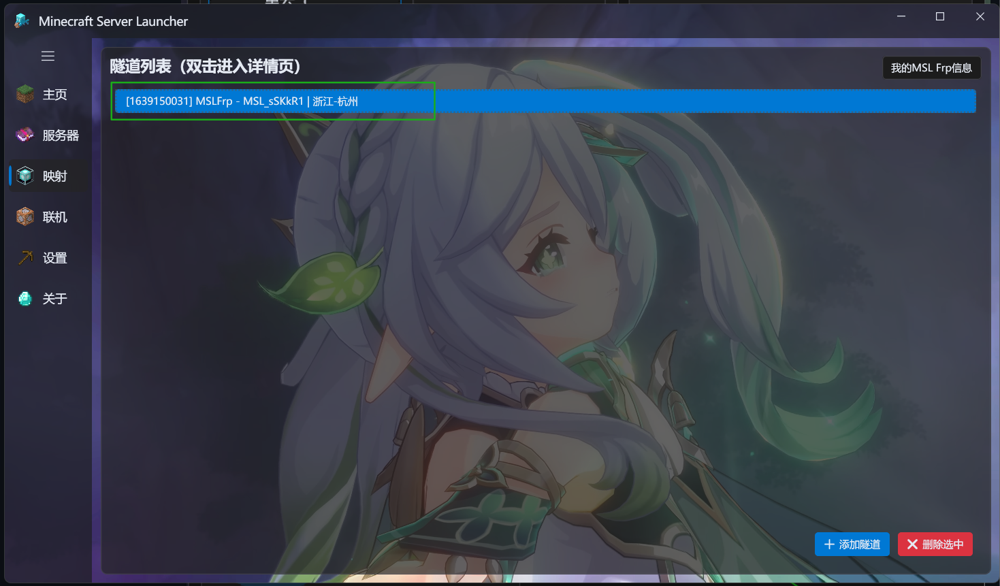

# 内网穿透配置

## [MSL Frp](https://user.mslmc.net/)

首先，切换到`映射`选项卡，然后点击`添加隧道`。

根据提示，输入`账号密码登录`。

若未注册MSL账户，请先前往[MSL用户中心](https://user.mslmc.net)注册账户。

进入创建隧道选项卡，选择就近的节点，填写相应的参数（如果不懂，那就不要改就好啦）。`KCP`一般不建议开。

创建隧道后，选择你创建的隧道，点击`选择该隧道`即可。

回到`隧道`选项卡主页，`双击`你刚才创建的隧道进入启动页面。

启动隧道，成功后即可使用连接地址进入您的MC服务器。

## 其它Frp

在这里可以选择其他服务商，按照提示登录即可~

目前支持的第三方服务商：OpenFrp，Sakura Frp，ChmlFrp，ME Frp

## 自定义Frp

粘贴配置文件进去就好~（建议`toml`格式）

