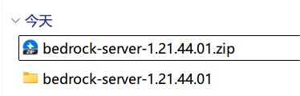
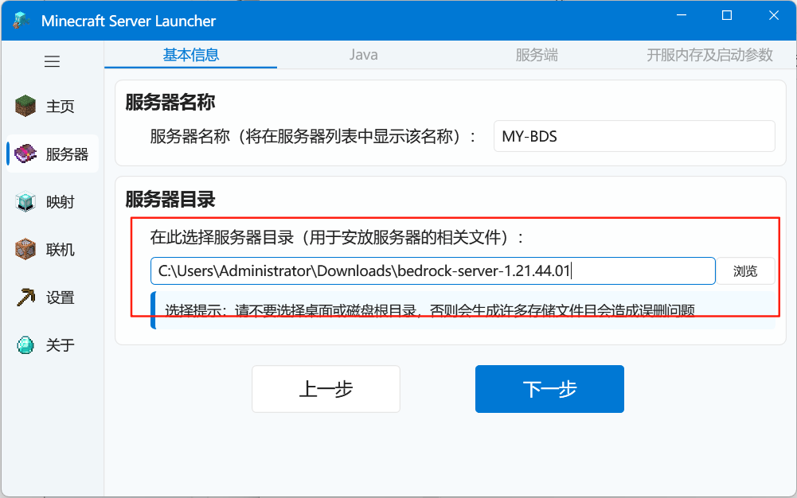
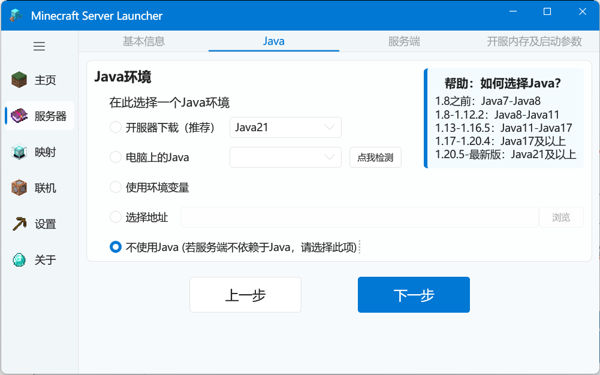
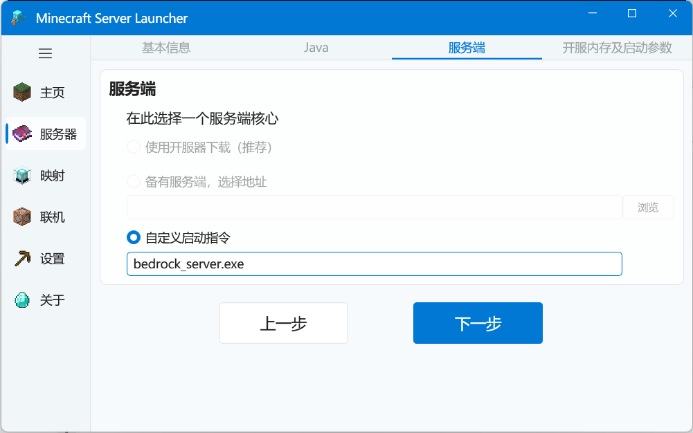
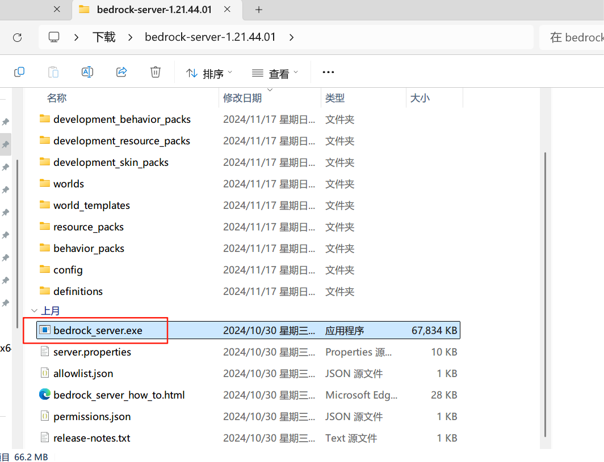
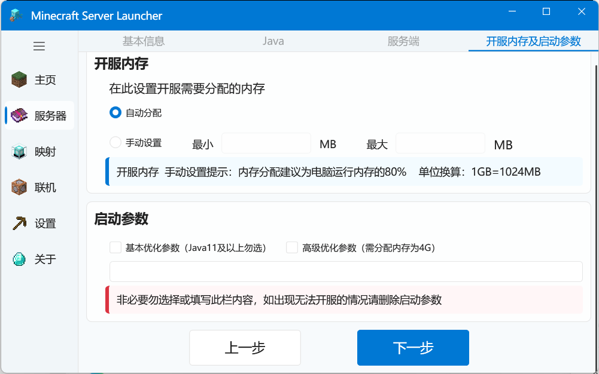
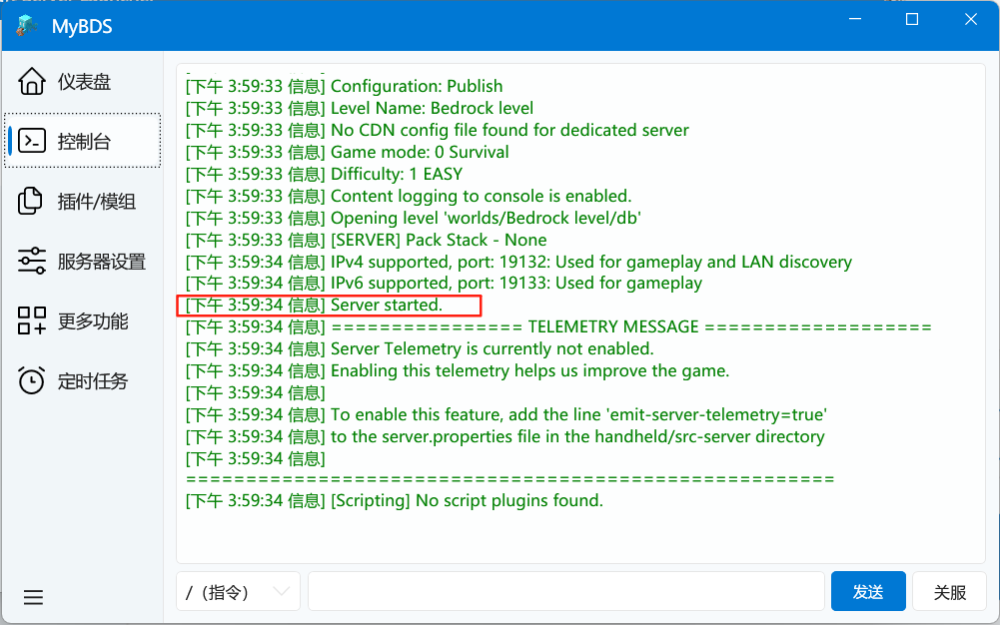

# 启动一个官方基岩版服务器（BDS）

这是热心群友 [七灝seven](https://space.bilibili.com/2112152080) 制作的视频教程↓↓↓

→前往bilibili观看 [MSL开服器开基岩版服务器视频教程](https://www.bilibili.com/video/BV1NzZpYZEjZ)

## 下载&解压服务端文件

首先，前往下载一个BDS服务端软件：

[基岩版服务器下载 | Minecraft](https://www.minecraft.net/zh-hans/download/server/bedrock)


接着，解压压缩包到一个你喜欢的地方（不会解压？[【电子扫盲课】【小白必看】如何解压压缩包？_哔哩哔哩_bilibili](https://www.bilibili.com/video/BV1xZ4y1v7pU/?spm_id_from=333.337.search-card.all.click)）



## 导入到MSL中

进入创建服务器页面，选择自定义模式（目前快速模式暂不支持创建BDS服务端）


接着，选择你刚刚解压出来的文件夹



选择Java页面，选择```不使用Java```



接着，在自定义命令处输入：```bedrock_server.exe```



这个bedrock_server.exe就是基岩版服务端的核心启动程序



接着，这里的东西都不需要动，都用不上



完成服务器创建，启动您的服务器即可！




::: tip TIPS
基岩版默认端口是19132  

使用的协议是udp

:::
