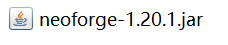
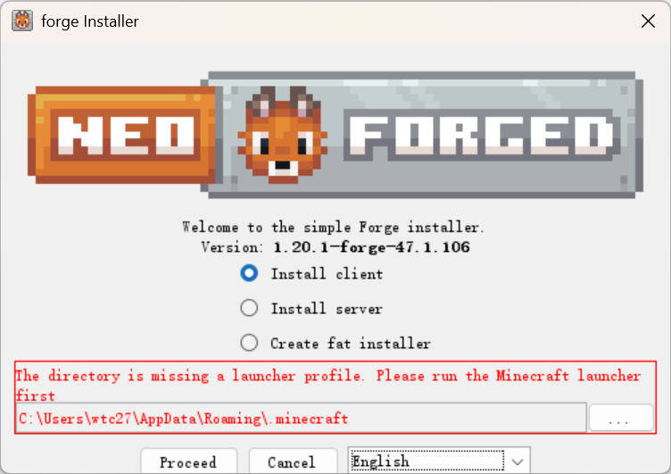
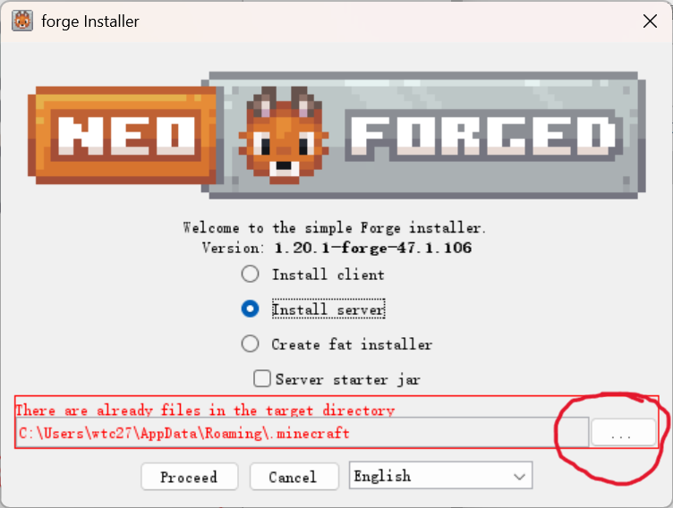
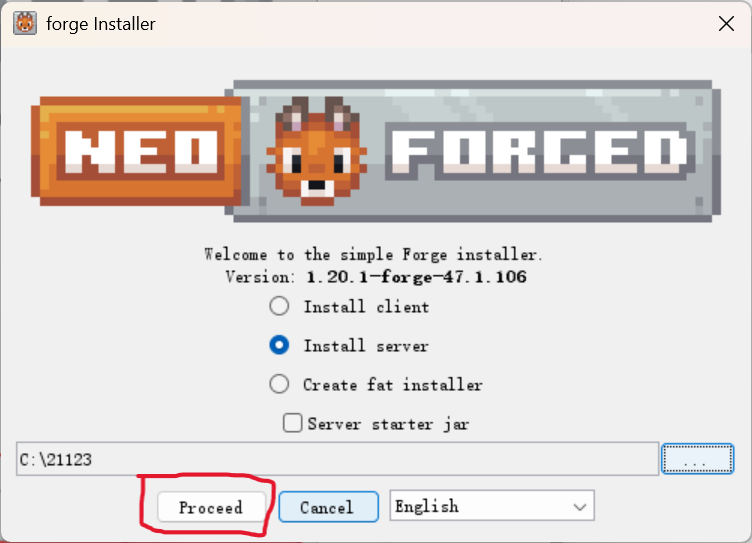
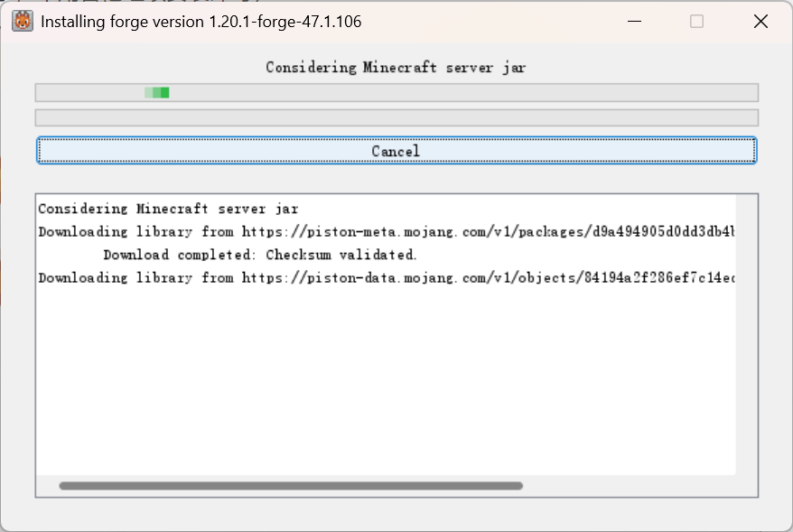
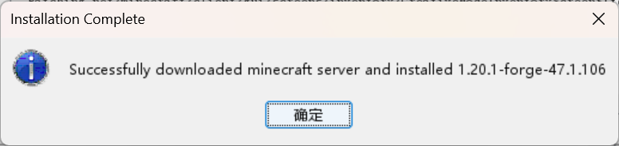
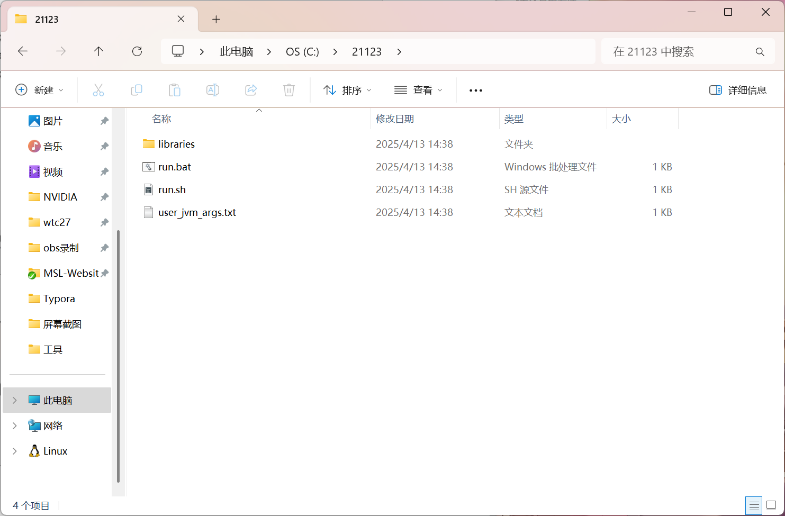
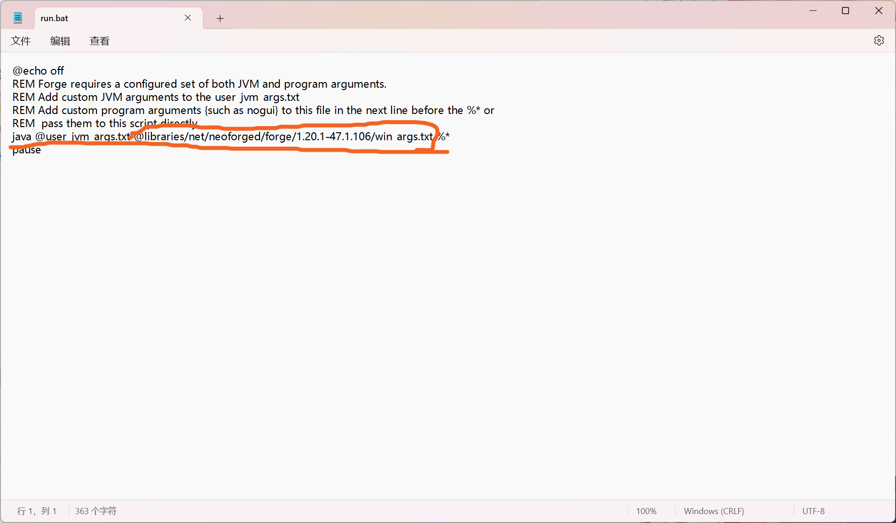
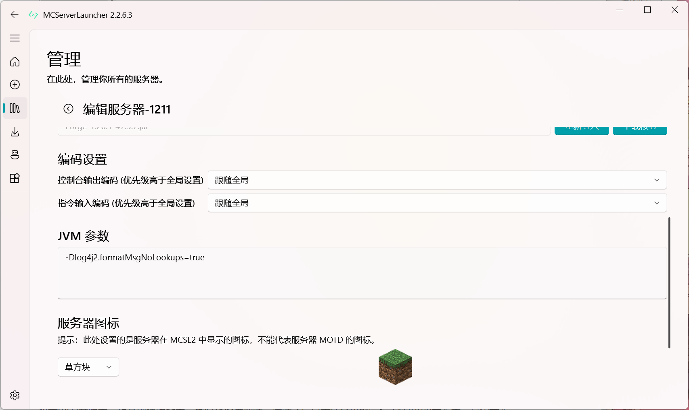
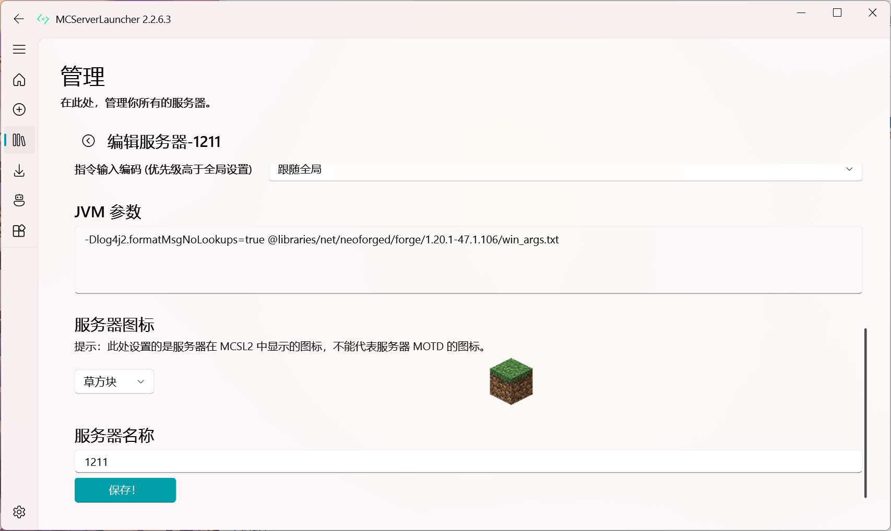

# 手动安装neoforge/forge

::: tip TIPS
我演示的是1.20.1neoforge的安装，forge安装和他差不多，有人第一眼就想问我这个图标怎么是这样的，你们是白色的文件图标，这是因为我安装了java，这里的java是指通过正常的安装程序，并不是解压的java，具体如何安装java程序请自行百度搜索
:::

双击该文件或者右击打开文件，耐心等待会出现一个安装窗口

出现的这个界面就是他的安装程序，默认应该是带有中文的，这里是为了同步forge才改的英文，这里我们能看到几个选项，我们要选中的是server，然后点击红色圈中的三个点，这里选择你想要安装的路径，建议放入一个单独的文件夹，核心放进去再双击打开该窗口

这里需要注意，你需要双击进入文件夹内才能安装在当前文件夹，然后点击左下角的proceed（这里有人可能会出现路径选择之后出现红色的提示，不用管他继续安装即可）

这是安装程序等待即可，由于采用官方原始下载方式所以可能需要换网络环境或者耐心等待即可

安装完成之后会出现以下窗口

这说明已经安装完成了查看安装的路径你应该能看到以下文件

我们右击run.bat点击编辑，这里能看到一些参数，我们需要看的是这行，画圈的部分复制一下

mcsl开服器可能会出现这情况，正常创建服务器，核心路径选择好，选好之后点击保存可能会提示你forge安装器，是否安装，点击取消，点击服务器管理界面的三个点，点击编辑服务器配置，往上翻能看到jvm参数

我们把刚才复制的参数粘贴进去，记得空一格再粘贴，然后点击下面的保存，这时候你应该能正常启动服务器了

