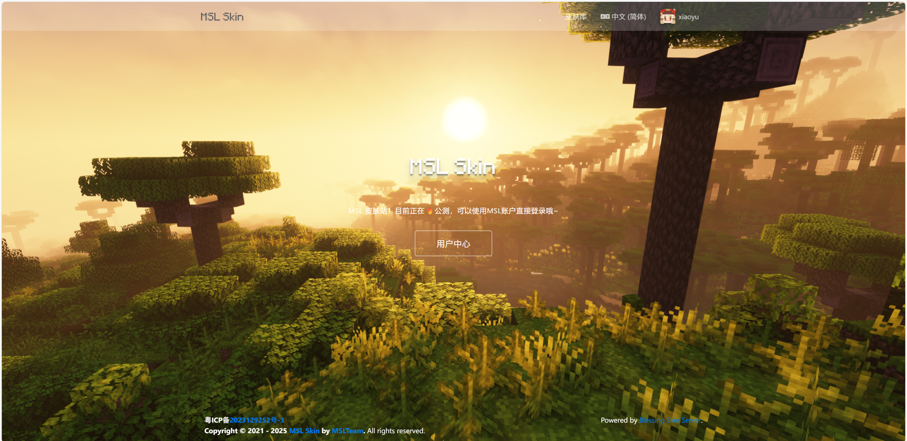
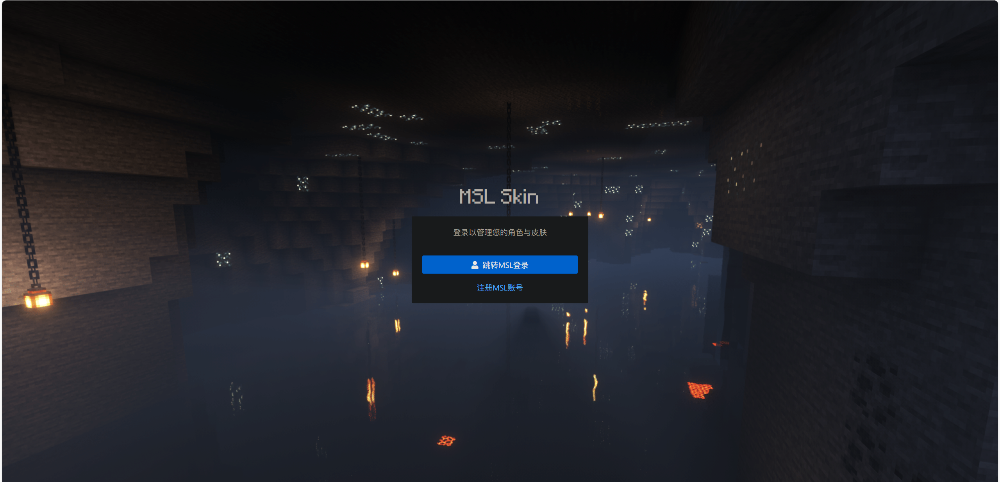
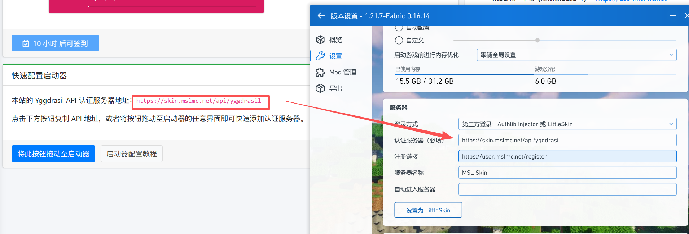
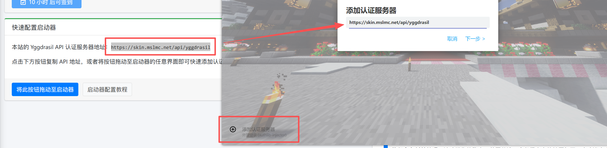
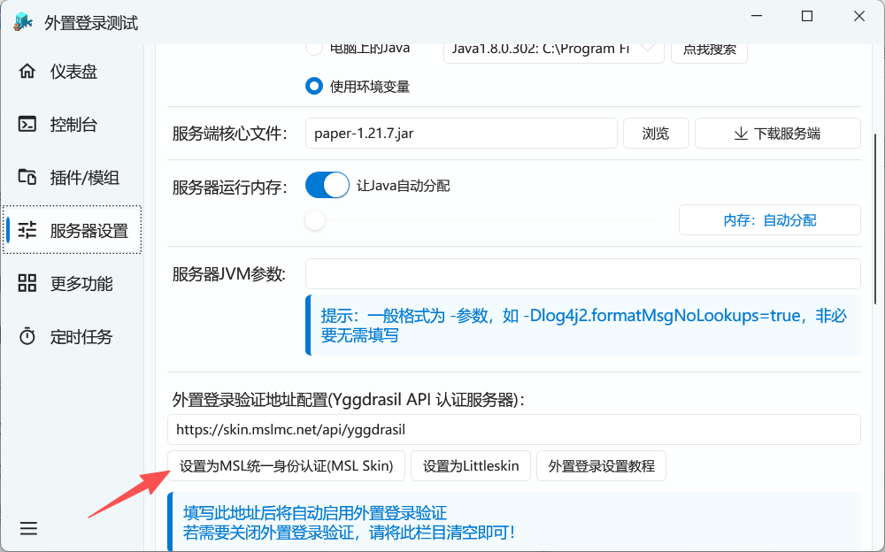
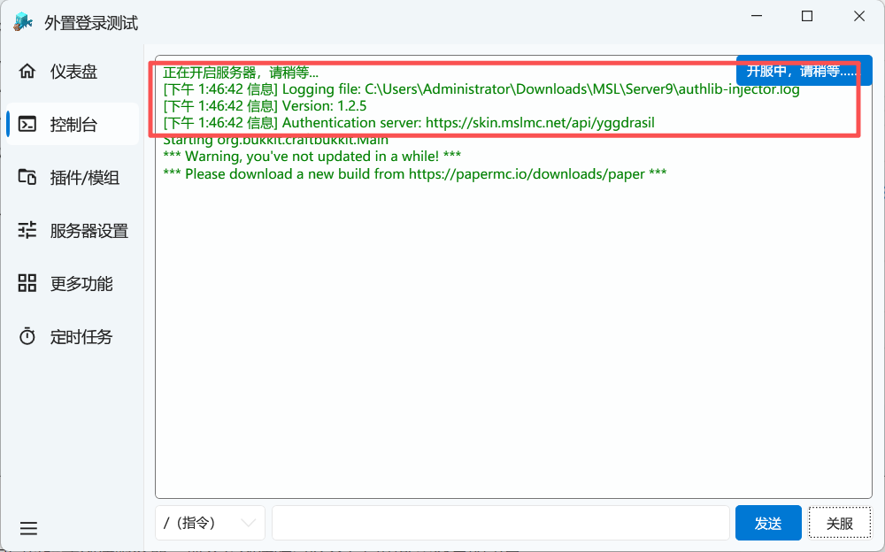
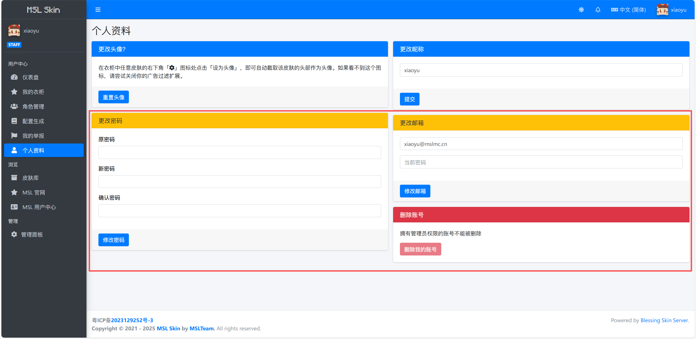

# MSL Skin (MSL皮肤站)

::: important ⚠️ 这并不能代替正版

请始终考虑购买正版的 Minecraft。

使用正版的 Minecraft 可以为你提供更省心的游玩体验。

:::

[MSL Skin (MSL皮肤站) ](https://skin.mslmc.net)是基于 [Blessing Skin](https://github.com/bs-community/blessing-skin-server/) 的一个MC皮肤站点，并且支持对接外置登录 Yggdrasil API 。

简单来说，MSL Skin可以提供联机时的皮肤和鉴权服务，但不提供联机服务本身。

此站点由MSLTeam二次开发，深度对接了[MSL用户系统](https://user.mslmc.net)，使用统一的MSL账号登录。

::: tip 有何优点？

- 只需要在启动器完成一次登录，无需进服后再次输入`/login`。
- 方便的使用皮肤系统，而不需要打其他的补丁。
- 优雅的账号控制，其他人无法随意伪造您的用户名，也不能轻易注册多重账号，还可以防止服务器遭到假人压测。

:::

## 登录到MSL Skin

正如上文所说，MSL Skin使用的账号是您的MSL账号 (即在MSL用户中心中注册的账号) ，进入MSL Skin网站登录时仅支持跳转MSL用户中心进行授权登录，`不支持账户密码登录`。如果您还没有MSL账号，您可以点击页面的注册按钮前往注册哦~

::: tip 关于默认角色名字

若您在MSL用户中心设置的昵称是符合角色名规范的，那么角色名将自动同步，若不符合命名规范，则会随机生成一个角色名，您可以在登录后自行修改。

:::

::: tip 关于UUID

本站采用了不兼容离线模式的UUID生成方式，即使您修改了游戏角色名，您的UUID也不会变化，换言之，`即使您修改了游戏角色名，您登录过的服务器玩家数据是不会变的`。

:::

::: tip 是否必须先登录皮肤站？

登录皮肤站`并非必须步骤`，您也可以按照下文配置好启动器外置登录后直接使用MSL账户的账户密码进行登录。但是如果需要修改角色名，还是需要前往皮肤站登录哦～

:::

## (玩家)游戏客户端配置&登录

目前主流的第三方启动器均支持配置外置登录，只需要填入MSL Skin页面提供的外置登录API地址即可，如：

::: tip 

如果您是服主分发整合包，可以提前配置好外置登录后再分发游戏哦~

:::

然后直接使用`MSL用户中心`的账户密码登录即可。

## (服主)在MSL中开服并将MSL Skin作为外置登录验证服务器

::: tip MSL支持情况

MSL从v3.7.0.4版本起支持一键配置外置登录，

MSL从v3.7.0.9版本起支持一键配置MSL Skin外置登录，

请您更新到最新版本的MSL使用此功能哦~

:::

非常简单，直接点击此按钮，然后保存就ok啦！

::: tip

如果您使用自定义模式创建服务器，那么在创建时已经会有启用外置登录的引导。

若您使用的是快速模式，您需要配置完成服务器后再前往服务器设置页面启用外置登录。

:::

启动服务器，出现以下提示即为配置成功！

::: warning 注意

一旦您的服务器启用了MSL Skin外置登录，您的所有玩家必须在游戏客户端配置好外置登录地址并登录MSL账号才能加入服务器哦。

并且，您需要开启正版验证，否则是无效的哦~

:::

## 使用MSL Skin登录进行联机

由于MC联机 (对局域网开放功能) 是默认存在`正版验证`的，若离线登录是无法进行联机的。

此时便可以联机者均使用MSL Skin外置登录，即可顺利完成联机！

::: warning 注意

MSL Skin可以提供联机时的皮肤和鉴权服务，但`不提供联机服务本身`。

:::

## MSL Skin资料设置的注意

MSL Skin账户跟随的是MSL用户中心的账户，所以这个页面框住的功能请不要使用 (其实也不能使用，原密码并非指的您MSL账户密码)，若需要修改资料，请前往MSL用户中心修改。

当然，这里的名称是可以修改的，MC角色名也可以随意修改。
