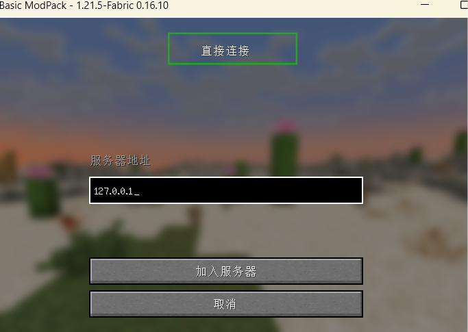

# 点对点联机教程

::: tip TIPS
点对点联机功能无法穿透所有类型的NAT，如果你无法成功联机，请使用内网映射功能  
由于Minecraft的限制，可能仅正版用户才能成功联机，若你是离线用户，请开服务器进行联机
:::

## 房主部分

1. 下载与你的客户端对应的自定义联机模组[点我下载](https://www.mcmod.cn/class/2754.html#:~:text=非专用服务器联机游戏)

2. 启动游戏，进入一个单人世界

3. 按ESC，呼出游戏菜单

4. 点击“对局域网络开放”

   

5. 根据个人需要调整配置并确认

   

6. 游戏左下角会给你一个端口，将此端口填入点对点联机的端口中

   

7. 点对点联机中的QQ号（房间号）填你自己的即可，密钥为其他玩家加入房间需填写的密码

   

8. 配置完成后，点击“开启房间”，即可让你的朋友加入

## 成员部分

1. 将房主给你的QQ号，密钥填入开服器

2. 端口号默认为25565即可，成员无需像房主那样更改端口号

   

3. 配置完成后，点击“加入房间”，即可进行连接

4. 连接成功后，进入和房主版本一致的Minecraft

5. 点击“多人游戏”

6. 点击“直接连接”（或“添加服务器”）

7. 在地址栏填写127.0.0.1（如果你更改了端口号，请在127.0.0.1后面加上半角冒号+你更改后的端口号，如：127.0.0.1:12337）

   

8. 然后即可成功联机