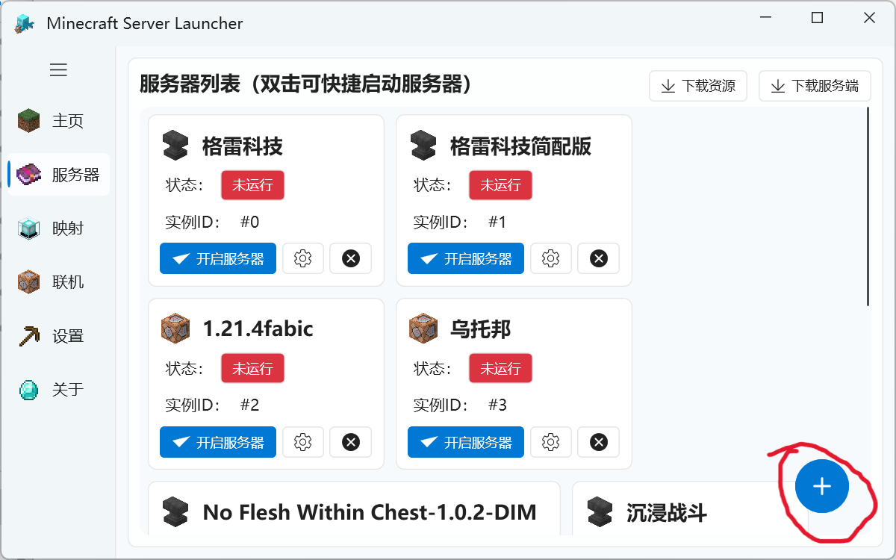
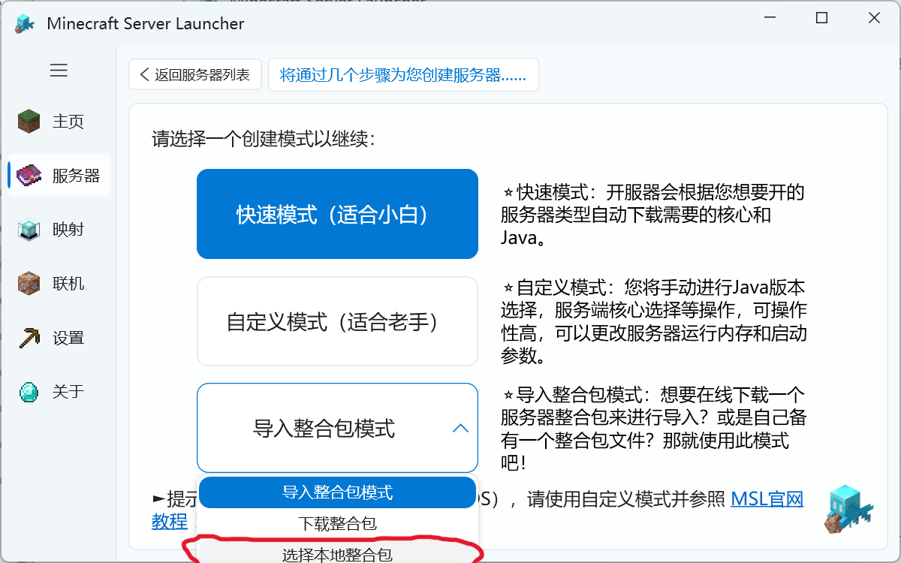

# 服务器导入整合包教程

首先，先确保你要导入整合包的类型为服务端（带有server或服务端字样），然后点击msl右下角的加号

然后点击导入整合包模式下的选择本地整合包

然后选择你下载整合包的位置，选择好之后就可以一直点击下一步，接下来的流程和正常开服流程一致

**注意：部分整合包作者比较贴心，分为server和java这俩文件夹，此时你需要自己解压并且把server文件夹的东西压缩，然后才能导入**