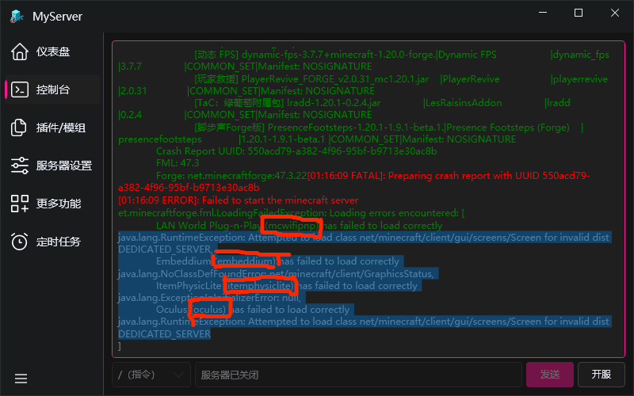
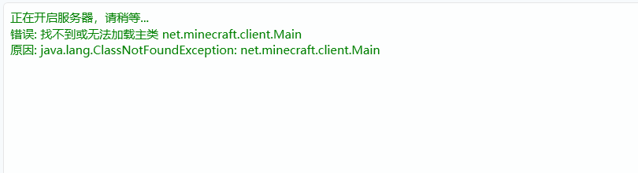
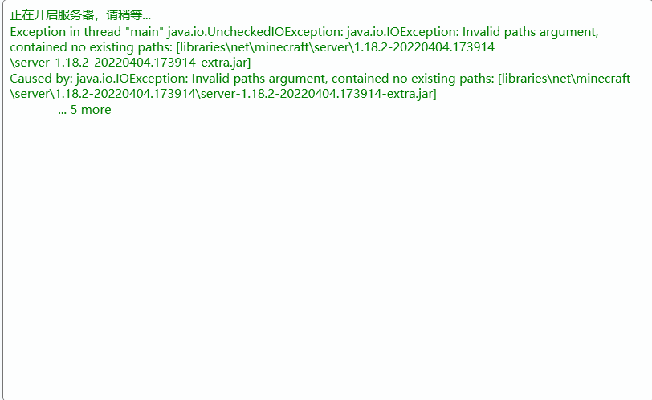
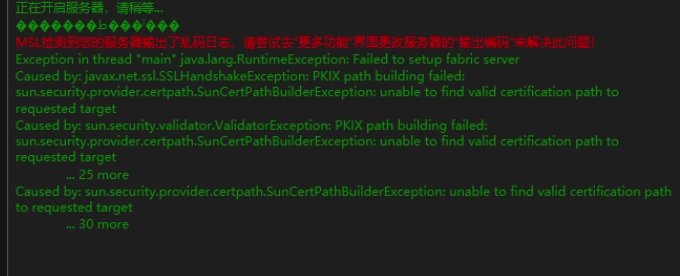
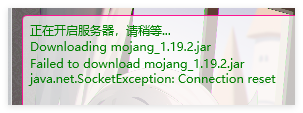

# **服务器崩溃**类型

**第一种：**

neoforge/forge服务端崩溃后最后可能输出这些字样，划红线的是你要删除的模组，你搜索这些括号内的文字并把它们删除，删除完毕你可以尝试再次开启服务器，这时候正常情况下应该不会出现崩溃了。

还有一个在导入整合包时遇见的非常常见的情况，控制台输出未找到主类：

看到client字样的都是**客户端的核心用在了服务端**，这是行不通的，你可以去寻找关于该整合包的服务端，或者尝试自己手搓服务端（说简单点就是资源同步），比如1.20.1fabric，你客户端和服务端都必须是这个版本，然后是资源同步（直接把客户端版本下的所有文件夹全部复制粘贴）。

**第二种：**    

在这张图上我们能看到libraries的一些路径，这可能是neoforge/forge安装失败了，重新创建即可

**第三种：**

这种情况少见

这里提到了ssl，这个可能是证书问题，在服务器设置往下翻找到jvm参数，输入-Djavax.net.ssl.trustStoreType=Windows-ROOT，然后点击保存并尝试开启服务器

**第四种：**

fabric服务端出现的  

这种情况换网络环境，例如用手机热点，或者挂梯子