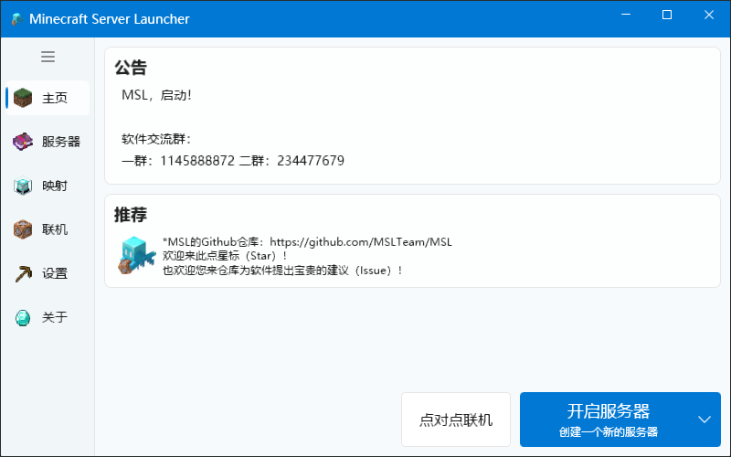
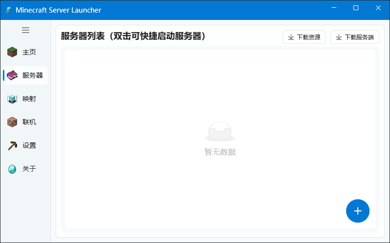
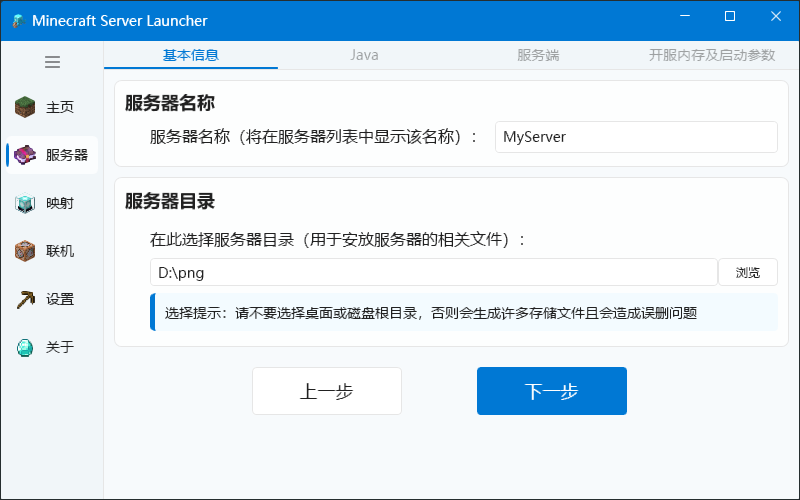
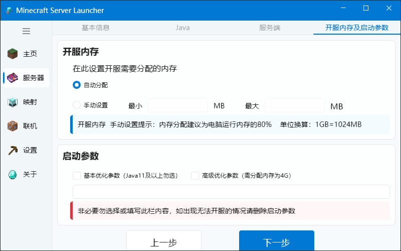
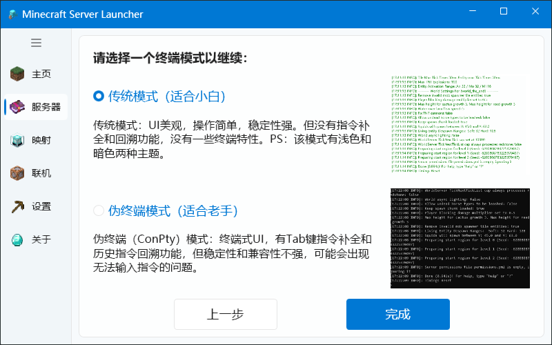
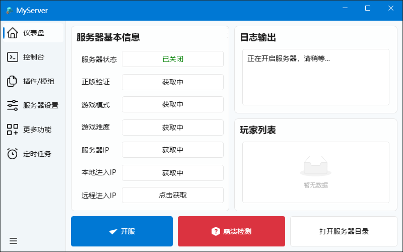

# 使用MSL开服

<!--
## 视频教程

<BiliBili bvid="BV1au4y1d7Td" />

## 文本教程
-->

::: important 运行环境
若您无法打开软件，请下载运行环境！（一般WIN10以上系统自带）  
运行环境: .Net Framework 4.7.2 [点击下载](https://dotnet.microsoft.com/en-us/download/dotnet-framework/thank-you/net472-developer-pack-offline-installer)

**另外请注意，请不要！不要！不要！将MSL直接放在C盘根目录或下载等目录下，否则后果自负！**

**在使用前请注意关闭一切杀毒软件，包括Windows Defender。**

:::

## 快速模式

根据软件内提示完成即可,此处不再赘述

但是你还是需要注意一件事：**最好不要在带有中文或其他特殊符号的目录下放置你的服务器**

## 自定义模式/已有服务器导入

首先在这里填写基本信息

**如果你已有服务端，请将服务器目录设置为你的服务端目录**

在这里根据个人的需求选择java

在这里依照你的情况选择下载或导入服务端

不会选择服务端？[看这里！](./other/choose-server-tips.md)

**如果你已经有了服务端，直接选择<备有服务端，选择地址>**

此处基本只需要下一步即可

在这里选择你将要使用的终端类型

Tips：目前ConPty终端还有许多未修复的问题，不建议使用！

点击完成，进入服务器界面

进入服务端界面

点击开服就大功告成了！
