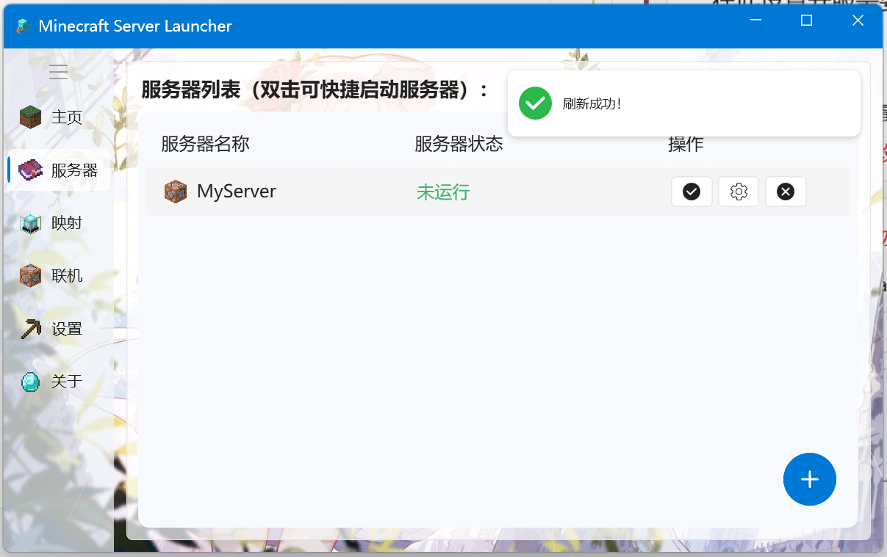

# 使用MSL开服

## 视频教程

<BiliBili bvid="BV1au4y1d7Td" />

## 文本教程

::: important 运行环境
若您无法打开软件，请下载运行环境！（一般WIN10以上系统自带）  
运行环境: .net Framework 4.7.2 [摁一下立刻下载](https://dotnet.microsoft.com/en-us/download/dotnet-framework/thank-you/net472-developer-pack-offline-installer)
:::

### 快速模式

根据软件内提示完成即可,此处不再赘述

### 自定义模式

首先在这里填写基本信息

在这里依照提示选择java

在这里依照你的情况选择下载或导入服务端

此处基本只需要下一步即可

回到主窗口,双击你的服务器即可开服

