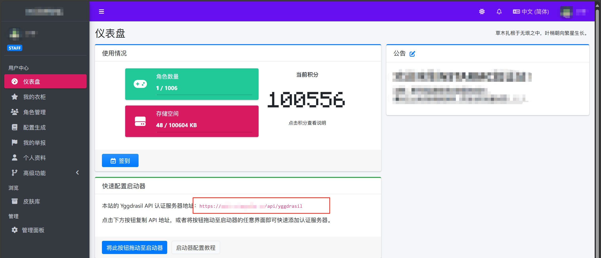
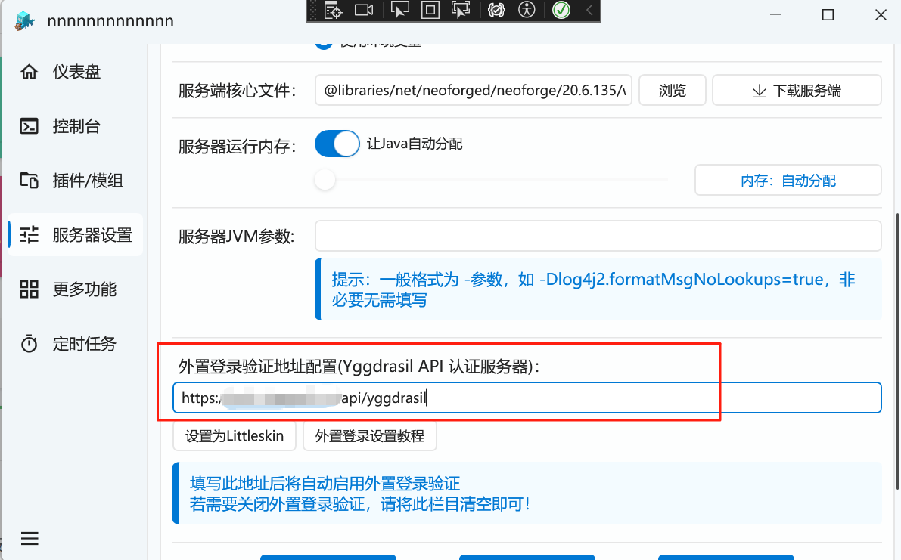
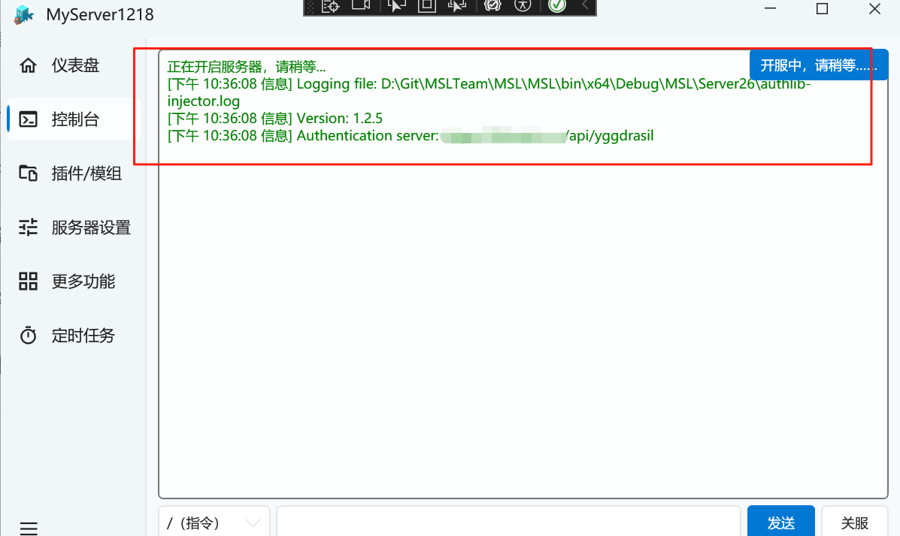
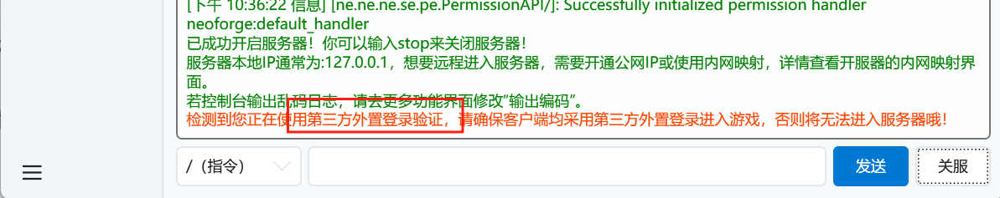

# 配置MSL(服务端)的外置登录

::: important ⚠️ 这并不能代替正版

请始终考虑购买正版的 Minecraft。

使用正版的 Minecraft 可以为你提供更省心的游玩体验。

:::

::: tip MSL支持情况

MSL从v3.7.0.4版本起支持一键配置外置登录，请您更新到最新版本的MSL使用此功能哦~

:::

::: warning 注意

一旦启用了外置登录，您的所有玩家必须使用同一外置登录服务进入游戏。

否则将无法正常加入服务器！

:::

## 配置外置登录

首先，在您的外置登录提供服务的站点处获取外置登录验证API地址，然后直接填入MSL服务器设置中即可！

（注意：不能只填写域名，必须是完整地址！）

若您使用Littleskin的服务，可以直接点击`设置为Littleskin`按钮即可

然后记得点击`保存`哦！

然后开启您的服务器即可，您不需要做任何的额外工作。（MSL将自动帮您下载最新版本的authlib-injector并嵌入您的服务端运行）

出现如下提示即为正常连接到您的外置登录服务。

## 自建外置登录服务（皮肤站）

使用此开源项目即可：

[bs-community/blessing-skin-server: Web application brings your custom skins back in offline Minecraft servers.](https://github.com/bs-community/blessing-skin-server)